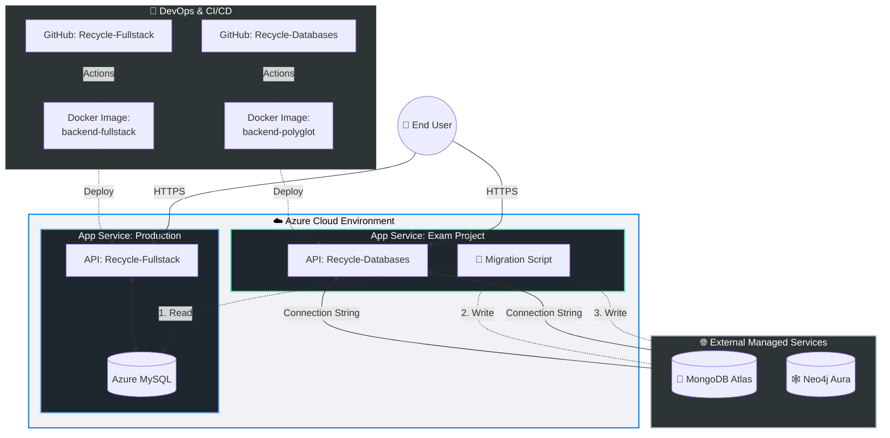
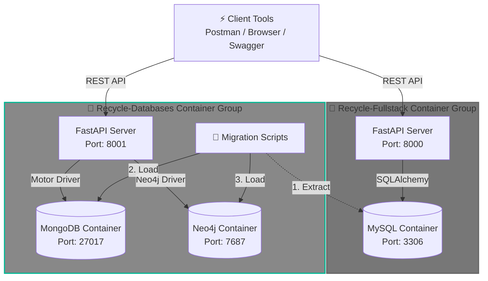
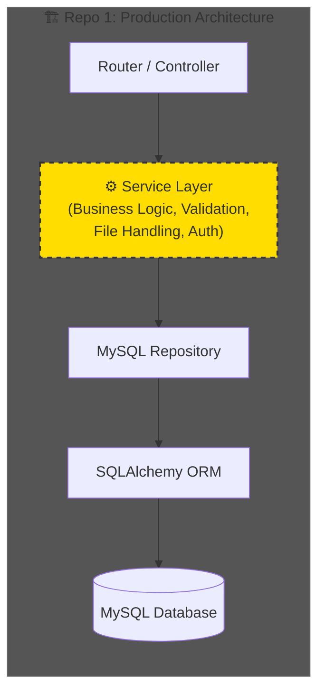
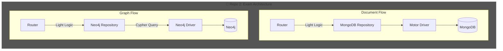

## System Landscape & Cloud Deployment

```mermaid
graph TD
    User((👤 End User))

    subgraph DevOps [🚀 DevOps & CI/CD]
        direction TB
        GH1[GitHub: Recycle-Fullstack] -->|Actions| DH1[Docker Image:<br/>backend-fullstack]
        GH2[GitHub: Recycle-Databases] -->|Actions| DH2[Docker Image:<br/>backend-polyglot]
        style DevOps fill:#2d3436,stroke:#fff,stroke-width:2px,color:#fff
    end

    subgraph Azure [☁️ Azure Cloud Environment]
        direction TB
        
        subgraph App1 [App Service: Production]
            Web1[API: Recycle-Fullstack] <--> DB1[(Azure MySQL)]
            style App1 fill:#1e272e,stroke:#74b9ff,stroke-width:2px,color:#fff
        end

        subgraph App2 [App Service: Exam Project]
            Web2[API: Recycle-Databases]
            %% Script runs inside the container in Azure
            ETL[🔄 Migration Script]
            style App2 fill:#1e272e,stroke:#55efc4,stroke-width:2px,color:#fff
        end

        %% Deployment Links
        DH1 -.->|Deploy| Web1
        DH2 -.->|Deploy| Web2
        
        style Azure fill:#f1f2f6,stroke:#0984e3,stroke-width:2px,color:#000
    end

    subgraph External [🌐 External Managed Services]
        Atlas[(🍃 MongoDB Atlas)]
        Aura[(🕸️ Neo4j Aura)]
        style External fill:#2d3436,stroke:#b2bec3,stroke-width:2px,color:#fff
    end

    %% Connections
    User -->|HTTPS| Web1
    User -->|HTTPS| Web2

    %% Database Connections crossing cloud boundaries
    Web2 <-->|Connection String| Atlas
    Web2 <-->|Connection String| Aura

    %% Migration Flow
    ETL -.->|1. Read| DB1
    ETL -.->|2. Write| Atlas
    ETL -.->|3. Write| Aura
```

## Local Development Architecture (Docker Compose)

```mermaid
graph TD
    Client[⚡ Client Tools<br/>Postman / Browser / Swagger]

    subgraph Group1 [🐳 Recycle-Fullstack Container Group]
        API_MySQL[FastAPI Server<br/>Port: 8000]
        DB_MySQL[(MySQL Container<br/>Port: 3306)]
        
        API_MySQL -->|SQLAlchemy| DB_MySQL
    end

    subgraph Group2 [🐳 Recycle-Databases Container Group]
        API_Poly[FastAPI Server<br/>Port: 8001]
        DB_Mongo[(MongoDB Container<br/>Port: 27017)]
        DB_Neo4j[(Neo4j Container<br/>Port: 7687)]
        
        API_Poly -->|Motor Driver| DB_Mongo
        API_Poly -->|Neo4j Driver| DB_Neo4j
        
        Script[🐍 Migration Scripts]
        Script -.->|1. Extract| DB_MySQL
        Script -->|2. Load| DB_Mongo
        Script -->|3. Load| DB_Neo4j
    end

    %% Access
    Client -->|REST API| API_MySQL
    Client -->|REST API| API_Poly

    style Group1 fill:#777,stroke:#666,stroke-width:2px
    style Group2 fill:#888,stroke:#00b894,stroke-width:2px
```

## Layered Architecture Comparison

```mermaid
flowchart TB
    subgraph Repo1_Arch [🏗️ Repo 1: Production Architecture]
        direction TB
        R1[Router / Controller]
        S1["⚙️ Service Layer
        (Business Logic, Validation,
        File Handling, Auth)"]
        Repo1[MySQL Repository]
        ORM[SQLAlchemy ORM]
        DB1[(MySQL Database)]
        
        R1 --> S1
        S1 --> Repo1
        Repo1 --> ORM
        ORM --> DB1
    end
        
    style S1 fill:#ffdd00,stroke:#333,stroke-width:2px,stroke-dasharray: 5 5
    style Repo1_Arch fill:#555,stroke:#666
```

```mermaid
flowchart TB
    subgraph Repo2_Arch [🧪 Repo 2: Exam Architecture]
        direction TB
        subgraph Mongo_Flow [Document Flow]
            R2[Router]
            Repo2[MongoDB Repository]
            Driver2[Motor Driver]
            DB2[(MongoDB)]
            
            R2 -->|Light Logic| Repo2
            Repo2 --> Driver2
            Driver2 --> DB2
        end
        
        subgraph Graph_Flow [Graph Flow]
            R3[Router]
            Repo3[Neo4j Repository]
            Driver3[Neo4j Driver]
            DB3[(Neo4j)]
            
            R3 -->|Light Logic| Repo3
            Repo3 -->|Cypher Query| Driver3
            Driver3 --> DB3
        end
    end
    
    style Repo2_Arch fill:#555,stroke:#666

```